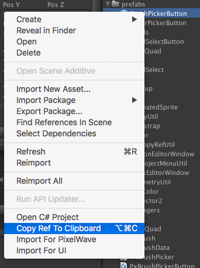

# Copy Reference Utility

This is a simple Unity3D editor utility. It lets you right-click on an asset in the Project tab and get a string representation that [Resources.Load()](http://docs.unity3d.com/ScriptReference/Resources.Load.html) likes. The string is copied to the clipboard so it can be pasted into code or other places.

[This is part of the Enemy Hideout Code Archive](http://enemyhideout.com/2016/05/free-code-from-the-hideout/)